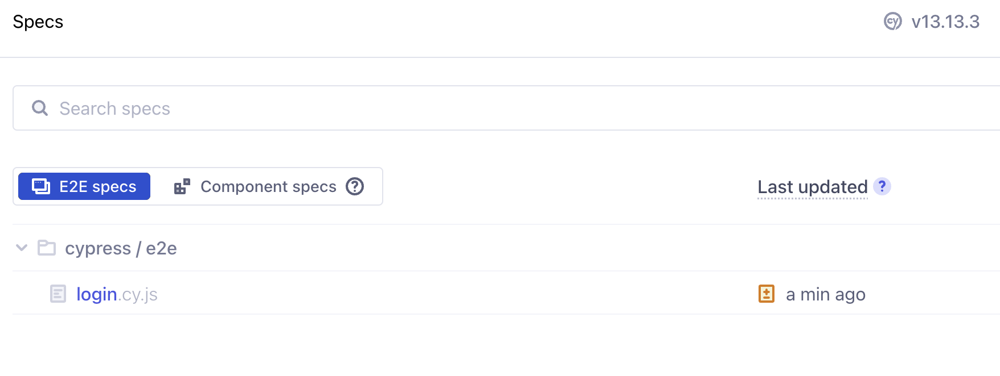

# Installation 

0. Ensure node.js is installed (https://nodejs.org/en/)
1. Clone this repo
2. Install dependences with ```npm install```
3. Launch the Cypress test runner by running ```npm run cy:open```
4. In the Cypress runner UI, run a test by clicking on its spec:


